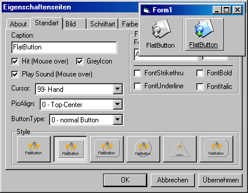



## A Flatbutton

### Description

That´s an nice goodie for all your project. I hade it to create allways icons in colors and in grey (for mouseover effects). You dont must do this longer, because this button do it automaticly. Add only your color icon an the Flatbutton is doing the rest. You can select difference Styles and much more. Have fun with this tool. If you add any nice featurs, please send me your update.
 
### More Info
 

             |
---                |---
**Submitted On**   |2001-06-26 20:13:18
**By**             |[Christian Reisch](https://github.com/Planet-Source-Code/PSCIndex/blob/master/ByAuthor/christian-reisch.md)
**Level**          |Advanced
**User Rating**    |4.9 (123 globes from 25 users)
**Compatibility**  |VB 3\.0, VB 4\.0 \(16\-bit\), VB 4\.0 \(32\-bit\), VB 5\.0, VB 6\.0
**Category**       |[OLE/ COM/ DCOM/ Active\-X](https://github.com/Planet-Source-Code/PSCIndex/blob/master/ByCategory/ole-com-dcom-active-x__1-29.md)
**World**          |[Visual Basic](https://github.com/Planet-Source-Code/PSCIndex/blob/master/ByWorld/visual-basic.md)
**Archive File**   |[A Flatbutt217386262001\.zip](https://github.com/Planet-Source-Code/christian-reisch-a-flatbutton__1-24464/archive/master.zip)

